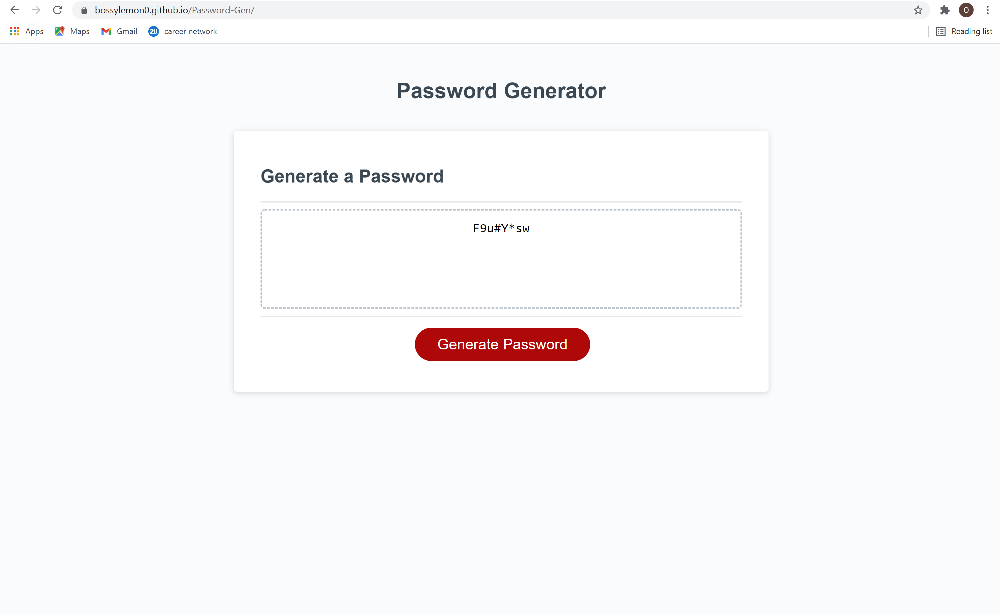

# Password-Gen
This password generator uses html and css, but uses javascript for it's main functionality. When generate password is pressed a series of prompts asks the user criteria. When criteria is met, a password generates on the page.

